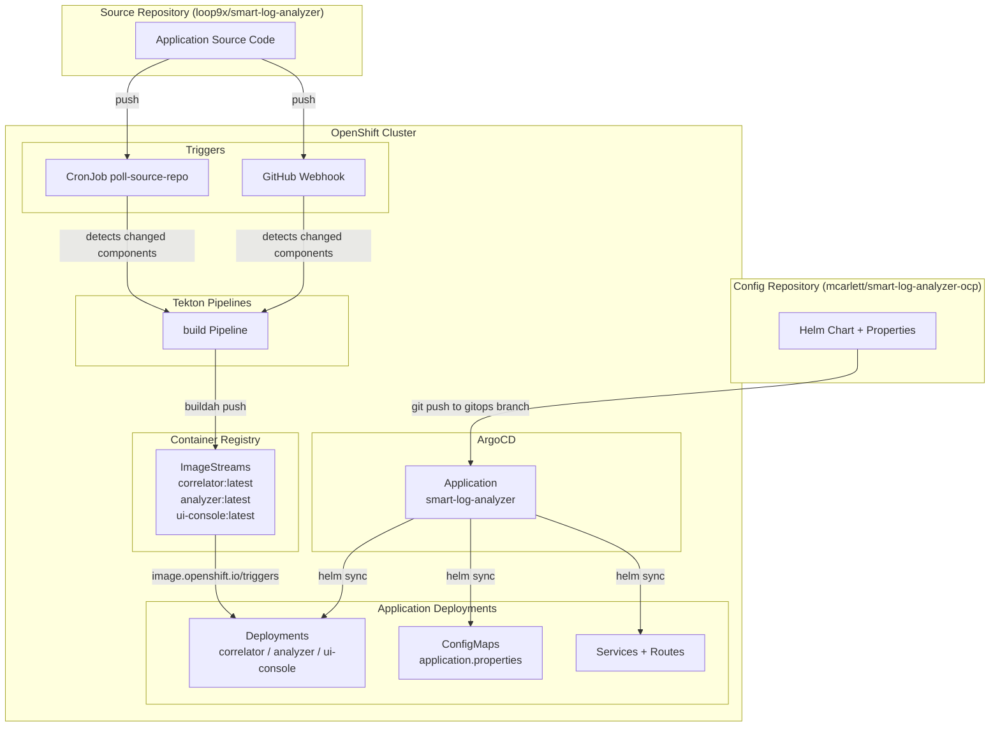
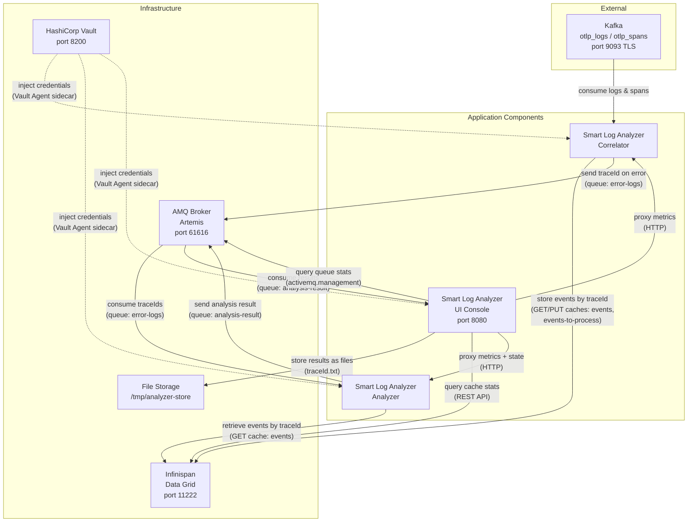
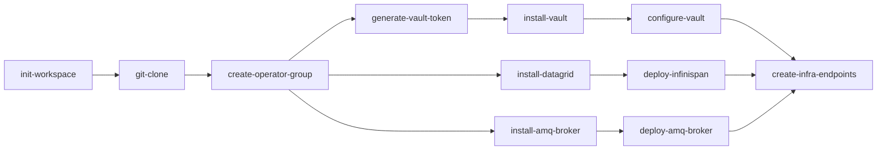
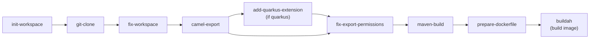

# Smart Log Analyzer OCP

Tekton pipelines and Helm chart for deploying infrastructure and Apache Camel JBang applications on OpenShift. The `infra-deploy` pipeline installs the required operators and deploys AMQ Broker, Infinispan (Data Grid) with pre-configured caches, and HashiCorp Vault for secrets management. The `build` pipeline builds container images from Camel JBang source code. Application deployment is managed by a Helm chart synced via ArgoCD (GitOps). A CronJob polls the source repository for changes (or a GitHub webhook triggers on push), and automatically creates `build` PipelineRuns only for the components that changed.

## Project Structure

```
smart-log-analyzer-ocp/
├── tasks/
│   ├── 00-install-operator.yaml        # Reusable task to install any OLM operator
│   ├── 01-deploy-amq-broker.yaml      # Deploys an ActiveMQArtemis instance
│   ├── 02-deploy-infinispan.yaml      # Deploys an Infinispan cluster with caches
│   ├── 03-create-infra-endpoints.yaml # Creates infra-endpoints ConfigMap with service URLs
│   ├── 04-generate-vault-token.yaml  # Generates a random Vault root token
│   ├── 05-configure-vault.yaml      # Waits for Vault pod and stores infra-accounts secrets
│   ├── 10-init-workspace.yaml         # Fixes PVC permissions for workspace
│   ├── 11-camel-export.yaml           # Runs camel export to target runtime (quarkus or spring-boot)
│   ├── 12-add-quarkus-extension.yaml  # Adds Quarkus extensions to the exported project
│   ├── 13-prepare-dockerfile.yaml     # Writes Dockerfile from base-image-config ConfigMap to workspace
│   └── 15-dispatch-builds.yaml        # Determines changed components from git diff and creates PipelineRuns
│
├── triggers/
│   ├── event-listener.yaml            # EventListener for GitHub push webhooks (filtered to main branch)
│   ├── trigger-binding.yaml           # Extracts repo URL and commit SHAs from webhook payload
│   ├── trigger-template.yaml          # Creates a dispatch-builds TaskRun on push events
│   ├── route.yaml                     # Route to expose the EventListener for GitHub webhooks
│   ├── poll-source-repo-config.yaml   # ConfigMap with polling parameters (source repo, runtime, etc.)
│   └── cronjob-poll.yaml              # CronJob that polls the Git repo for changes (suspended by default)
│
├── pipeline/
│   ├── build.yaml           # Build-only pipeline: exports, compiles, and pushes container images
│   └── infra-deploy.yaml               # Pipeline to install operators and deploy AMQ Broker, Infinispan + Vault
│
├── pipelinerun/
│   ├── build-run.yaml           # Example PipelineRun for the correlator component
│   └── infra-deploy-run.yaml               # Example PipelineRun for operator installation
│
├── helm/
│   └── smart-log-analyzer/
│       ├── Chart.yaml                      # Helm chart metadata
│       ├── values.yaml                     # Default values (all components enabled)
│       ├── values-quarkus.yaml             # Quarkus runtime overrides (Netty workaround)
│       ├── values-spring-boot.yaml         # Spring Boot runtime overrides
│       ├── templates/
│       │   ├── deployment.yaml             # Deployment for each enabled component
│       │   ├── configmap.yaml              # App-config ConfigMap with runtime-specific properties
│       │   ├── service.yaml                # Service for exposed components
│       │   ├── route.yaml                  # Edge TLS Route for exposed components
│       │   └── pvc.yaml                    # PVC for components with persistent storage
│       └── properties/                     # Runtime-specific application properties per component
│           ├── correlator/
│           ├── analyzer/
│           └── ui-console/
│
├── gitops/
│   └── application.yaml                    # ArgoCD Application CR for deploying via Helm chart
│
└── resources/
    ├── amq-broker/
    │   └── artemis.yaml                     # ActiveMQArtemis CR definition
    ├── infinispan/
    │   ├── infinispan.yaml                  # Infinispan CR definition
    │   └── caches/
    │       ├── events.json                  # Cache config for 'events' (600s lifespan)
    │       └── events-to-process.json       # Cache config for 'events-to-process' (20s lifespan)
    ├── rbac/
    │   ├── pipeline-clusterrole.yaml        # Scoped ClusterRole for the pipeline SA
    │   └── pipeline-clusterrolebinding.yaml  # Binds the ClusterRole to the pipeline SA
    ├── app-config/
    │   ├── correlator/
    │   │   ├── application-prod-quarkus.properties      # Production config for Quarkus runtime
    │   │   └── application-prod-spring-boot.properties  # Production config for Spring Boot runtime
    │   ├── analyzer/
    │   │   ├── application-prod-quarkus.properties      # Production config for Quarkus runtime
    │   │   └── application-prod-spring-boot.properties  # Production config for Spring Boot runtime
    │   └── ui-console/
    │       ├── application-prod-quarkus.properties      # Production config for Quarkus runtime
    │       └── application-prod-spring-boot.properties  # Production config for Spring Boot runtime
    ├── vault/
    │   └── sa-hashicorp-vault.yaml          # ServiceAccount for application access to Vault
    ├── configmaps/
    │   ├── base-image-config-quarkus.yaml       # Dockerfile for Quarkus fast-jar image layout
    │   ├── base-image-config-spring-boot.yaml   # Dockerfile for Spring Boot fat-jar image layout
    │   └── otel-infra-endpoints.yaml            # Endpoints for the existing OpenTelemetry infrastructure
    ├── secrets/
    │   └── infra-accounts.yaml              # Infrastructure credentials (AMQ Broker, Data Grid)
    └── templates/
        ├── project.yaml                     # Project/namespace with ArgoCD management label
        ├── kafka-cluster-ca.yaml            # Template for Kafka cluster CA certificate (must be populated and applied manually)
        └── openai-config.yaml               # Template for OpenAI/LLM configuration (API key, base URL, model)
```

## Deployment Overview



**Source code changes** (correlator, analyzer, ui-console) are detected by the CronJob or webhook, which triggers the `build` pipeline for each changed component. The pipeline builds a container image and pushes it to the internal registry. The `image.openshift.io/triggers` annotation on each Deployment automatically triggers a rollout when the ImageStream tag is updated.

**Helm chart or properties changes** are detected by ArgoCD, which syncs the Helm chart from the `gitops` branch and updates the Deployments, ConfigMaps, Services, and Routes.

## Application Architecture



The **correlator** consumes OpenTelemetry logs and spans from Kafka, correlates them by traceId in Infinispan, and sends error traceIds to the AMQ `error-logs` queue. When cached events expire (after 20s without new errors), the traceId is also forwarded to the queue.

The **analyzer** picks up traceIds from the `error-logs` queue, retrieves the correlated events from Infinispan, sends them to an LLM (OpenAI-compatible API) for root cause analysis, and publishes the result to the `analysis-result` queue.

The **ui-console** consumes analysis results from the `analysis-result` queue, stores them as files, and exposes a REST API (port 8080) for listing and viewing results. It also proxies Prometheus metrics from all components and queries Infinispan/AMQ for live infrastructure stats.

All components receive infrastructure credentials (AMQ, Data Grid) and component-specific secrets (e.g. OpenAI API key) via the **Vault Agent Injector** sidecar.

## Pipeline Execution Order

### infra-deploy



| Task | Source | Description |
|---|---|---|
| **init-workspace** | Custom | Fixes PVC permissions |
| **git-clone** | `openshift-pipelines` | Clones this repository to access resource files |
| **create-operator-group** | `openshift-pipelines` | Creates the OperatorGroup for the namespace |
| **install-operator** | Custom | Installs an OLM operator via Subscription, waits for CSV to succeed |
| **deploy-amq-broker** | Custom | Applies `resources/amq-broker/artemis.yaml`, waits for pod ready |
| **deploy-infinispan** | Custom | Applies `resources/infinispan/infinispan.yaml`, creates caches from `resources/infinispan/caches/*.json` |
| **generate-vault-token** | Custom | Generates a random UUID-based root token for Vault |
| **install-vault** | `openshift-pipelines` | Installs the Vault Helm chart from repo using `helm-upgrade-from-repo` (dev mode, random root token) |
| **configure-vault** | Custom | Waits for Vault pod to be ready, writes all `infra-accounts` secrets to `secret/<key>`, creates `sa-hashicorp-vault` service account with Kubernetes auth |
| **create-infra-endpoints** | Custom | Creates `infra-endpoints` ConfigMap with AMQ Broker, Infinispan, and Vault service URLs |

### build

Builds container images from Camel JBang applications. Deployment is handled separately by the Helm chart via ArgoCD.



| Task | Source | Description |
|---|---|---|
| **init-workspace** | Custom | Fixes PVC permissions |
| **git-clone** | `openshift-pipelines` | Clones the source repository |
| **fix-workspace** | Custom | Fixes permissions after git-clone for subsequent tasks |
| **camel-export** | Custom | Runs `camel export --runtime=<runtime>` to generate a Quarkus or Spring Boot project, with optional `--dep` for additional dependencies |
| **add-quarkus-extension** | Custom | Adds Quarkus extensions to the exported project (skipped for spring-boot runtime) |
| **fix-export-permissions** | Inline | Fixes workspace permissions after export/extensions (always runs regardless of runtime) |
| **maven-build** | Inline | Runs `./mvnw clean package` using `ubi9/openjdk-21` to build the application |
| **prepare-dockerfile** | Custom | Writes Dockerfile from `base-image-config-<runtime>` ConfigMap to workspace (Quarkus fast-jar or Spring Boot fat-jar layout) |
| **buildah** | `openshift-pipelines` | Builds the container image and pushes to the internal registry |

## Prerequisites

- OpenShift 4 cluster
- Red Hat OpenShift Pipelines operator installed (provides `git-clone`, `buildah`, `openshift-client`, `helm-upgrade-from-repo` ClusterTasks and Tekton Triggers)
- Red Hat OpenShift GitOps operator installed
- Tekton CLI (`tkn`) (optional, for monitoring runs)
- Kafka cluster CA certificate: populate `resources/templates/kafka-cluster-ca.yaml` with the CA certificate (PEM format) of the external Kafka cluster used for OpenTelemetry data
- OpenAI configuration: edit `resources/templates/openai-config.yaml` with the desired API key, base URL, and model, then apply it before deploying the analyzer (`oc apply -f resources/templates/openai-config.yaml -n slog-analyzer`)

The following operators are installed automatically by the `infra-deploy` pipeline:

| Operator | Channel | Description |
|---|---|---|
| `datagrid` | `stable` | Red Hat Data Grid (Infinispan) operator |
| `amq-broker-rhel9` | `7.13.x` | Red Hat AMQ Broker operator |

HashiCorp Vault is installed via the [Helm chart](https://helm.releases.hashicorp.com) (`hashicorp/vault`) in dev mode, not as an operator.

## Usage

### Initial setup

```bash
# Create the target namespace with ArgoCD management label
oc apply -f resources/templates/project.yaml

# Apply RBAC, secrets, configmaps, tasks, and pipelines
oc apply -f resources/rbac/
oc apply -f resources/secrets/
oc apply -f resources/configmaps/
oc apply -f tasks/
oc apply -f pipeline/

# Install operators and deploy AMQ Broker, Infinispan + Vault
oc create -f pipelinerun/infra-deploy-run.yaml

# Create the kafka-cluster-ca secret (see Kafka TLS section below)

# Create the openai-config secret (see OpenAI configuration section below)
oc apply -f resources/templates/openai-config.yaml -n slog-analyzer
```

### Deploy applications with Helm / ArgoCD

The `helm/smart-log-analyzer/` chart deploys all three application components (correlator, analyzer, ui-console) with runtime-specific configuration. The chart creates Deployments, ConfigMaps, Services, Routes, and PVCs based on the selected runtime.

#### Using ArgoCD (recommended)

Apply the ArgoCD Application CR to deploy the applications via GitOps:

```bash
oc apply -f gitops/application.yaml
```

The Application syncs the Helm chart from this repository (branch `gitops`). To switch runtime, edit `gitops/application.yaml` and change the `valueFiles`:

```yaml
helm:
  valueFiles:
    - values-quarkus.yaml      # or values-spring-boot.yaml
```

#### Using Helm directly

```bash
# Deploy with Quarkus runtime
helm install smart-log-analyzer helm/smart-log-analyzer/ \
  -f helm/smart-log-analyzer/values-quarkus.yaml \
  -n slog-analyzer

# Deploy with Spring Boot runtime
helm install smart-log-analyzer helm/smart-log-analyzer/ \
  -f helm/smart-log-analyzer/values-spring-boot.yaml \
  -n slog-analyzer

# Upgrade after changes
helm upgrade smart-log-analyzer helm/smart-log-analyzer/ \
  -f helm/smart-log-analyzer/values-spring-boot.yaml \
  -n slog-analyzer
```

### Automatic image builds

The `build` pipeline builds container images when source code changes. Two approaches are available to trigger builds automatically.

On the first run (or when application deployments are missing), the CronJob/webhook builds **all** components and applies the ArgoCD Application CR to deploy them via the Helm chart. On subsequent runs, only components with changed source files are rebuilt.

#### Option A: Polling CronJob (cluster not reachable from GitHub)

A CronJob polls the Git repository every 5 minutes using the GitHub API and triggers builds for changed components. It stores the last known commit SHA in a `source-repo-state` ConfigMap. The CronJob is **suspended by default** and must be explicitly enabled after configuration.

First, configure the polling parameters by editing `triggers/poll-source-repo-config.yaml`, then apply the ConfigMap and the CronJob:

```bash
# Apply the configuration ConfigMap and the CronJob
oc apply -f triggers/poll-source-repo-config.yaml -n slog-analyzer
oc apply -f triggers/cronjob-poll.yaml -n slog-analyzer

# Enable the CronJob
oc patch cronjob poll-source-repo -n slog-analyzer -p '{"spec":{"suspend":false}}'
```

To suspend it again:

```bash
oc patch cronjob poll-source-repo -n slog-analyzer -p '{"spec":{"suspend":true}}'
```

The polling interval can be adjusted by editing the `schedule` field in `triggers/cronjob-poll.yaml` (default: `*/5 * * * *`).

The `poll-source-repo-config` ConfigMap contains the following keys:

| Key | Default | Description |
|---|---|---|
| `GITHUB_OWNER` | `loop9x` | GitHub repository owner |
| `GITHUB_REPO` | `smart-log-analyzer` | GitHub repository name |
| `BRANCH` | `main` | Branch to poll |
| `REPO_URL` | `https://github.com/loop9x/smart-log-analyzer.git` | Full Git clone URL |
| `APP_ROOT` | _(empty)_ | Root subfolder containing component directories (e.g. `smart-log-analyzer`). If empty, components are at the repo root |
| `RUNTIME` | `spring-boot` | Target runtime: `quarkus` or `spring-boot` |
| `CAMEL_IMAGE` | `quay.io/mcarlett/camel-launcher:4.18.0` | Image with the Camel CLI |
| `CONFIG_REPO_URL` | `https://github.com/mcarlett/smart-log-analyzer-ocp.git` | Config repository URL (Helm chart) |
| `CONFIG_REPO_REVISION` | `gitops` | Config repository branch |
| `DEPS` | `camel-observability-services` | Additional dependencies for `camel export` (`--dep`) |

#### Option B: GitHub Webhook (cluster reachable from GitHub)

Uses Tekton Triggers with an EventListener exposed via a Route:

```bash
# Apply Tekton Triggers resources (EventListener, TriggerBinding, TriggerTemplate, Route)
oc apply -f triggers/event-listener.yaml -f triggers/trigger-binding.yaml -f triggers/trigger-template.yaml -f triggers/route.yaml -n slog-analyzer
oc apply -f tasks/15-dispatch-builds.yaml -n slog-analyzer

# Get the webhook URL
WEBHOOK_URL=$(oc get route github-webhook -n slog-analyzer -o jsonpath='https://{.spec.host}')
echo "Webhook URL: ${WEBHOOK_URL}"
```

Then configure a webhook in GitHub (Settings → Webhooks):

- **Payload URL**: the webhook URL from above
- **Content type**: `application/json`
- **Events**: Just the push event

### Monitor runs

```bash
# Follow logs of the latest run
tkn pipelinerun logs -f -L

# List pipeline runs
tkn pipelinerun list
```

### Manual image build

To manually trigger an image build for a specific component:

```bash
tkn pipeline start build \
  -p app-path=correlator \
  -p app-name=correlator \
  -p gav=com.example:correlator:1.0.0 \
  -p runtime=quarkus \
  -w name=shared-workspace,volumeClaimTemplateFile=pipelinerun/build-run.yaml
```

The pipeline only builds and pushes the container image. Deployment is handled by the Helm chart (see [Deploy applications with Helm / ArgoCD](#deploy-applications-with-helm--argocd)).

If the source repository uses a subfolder (e.g. `smart-log-analyzer/correlator`), set `app-path` accordingly:

```bash
tkn pipeline start build \
  -p repo-url=https://github.com/mcarlett/camel-jbang-examples.git \
  -p app-path=smart-log-analyzer/correlator \
  -p app-name=correlator \
  -p gav=com.example:correlator:1.0.0 \
  -p runtime=quarkus \
  -w name=shared-workspace,volumeClaimTemplateFile=pipelinerun/build-run.yaml
```

## Configuration

### build parameters

| Parameter | Default | Description |
|---|---|---|
| `repo-url` | `https://github.com/loop9x/smart-log-analyzer.git` | Git repository URL |
| `repo-revision` | `main` | Git branch, tag, or commit SHA |
| `app-path` | `correlator` | Path within the repo to the Camel app (e.g. `correlator` or `smart-log-analyzer/correlator`) |
| `app-name` | `correlator` | Application name (used for the container image) |
| `namespace` | `slog-analyzer` | Target namespace for the container image |
| `camel-image` | `quay.io/mcarlett/camel-launcher:4.18.0` | Image with the Camel CLI (configurable) |
| `gav` | `com.example:correlator:1.0.0` | Maven groupId:artifactId:version |
| `runtime` | `quarkus` | Target runtime for the camel export: `quarkus` or `spring-boot` |
| `runtime-version` | _(empty)_ | Runtime platform version (Quarkus or Spring Boot). If empty, uses the default from camel export |
| `extensions` | _(empty)_ | Comma-separated list of Quarkus extensions to add (only used with quarkus runtime) |
| `deps` | `camel-observability-services` | Comma-separated list of additional dependencies to add during `camel export` via `--dep` |

### Helm chart values

| Value | Default | Description |
|---|---|---|
| `namespace` | `slog-analyzer` | Target namespace |
| `runtime` | `quarkus` | Runtime: `quarkus` or `spring-boot` |
| `imageRegistry` | `image-registry.openshift-image-registry.svc:5000` | Container image registry |
| `components.<name>.enabled` | `true` | Enable/disable a component |
| `components.<name>.replicas` | `1` | Number of replicas |
| `components.<name>.memoryLimit` | `2Gi` | Memory limit |
| `components.<name>.strategy` | `RollingUpdate` | Deployment strategy (`RollingUpdate` or `Recreate`) |
| `components.<name>.expose` | `false` | Create Service and edge TLS Route |
| `components.<name>.storage.mountPath` | _(empty)_ | PVC mount path (creates `<name>-storage` PVC) |
| `components.<name>.storage.size` | `1Gi` | PVC size |
| `components.<name>.extraEnv` | `[]` | Additional environment variables |
| `components.<name>.vaultSecrets` | `[]` | Additional Vault secrets to inject (see below) |
| `vault.role` | `sa-hashicorp-vault` | Vault Kubernetes auth role |
| `vault.serviceAccount` | `sa-hashicorp-vault` | ServiceAccount for Vault authentication |
| `quarkus.nettyWorkaround` | `true` | Set `-Dio.netty.transport.noNative=true` (Quarkus only) |

### infra-deploy parameters

| Parameter | Default | Description |
|---|---|---|
| `namespace` | `slog-analyzer` | Target namespace for operator and CR deployment |
| `repo-url` | `https://github.com/mcarlett/smart-log-analyzer-ocp.git` | Git repository URL containing resource files |
| `repo-revision` | `main` | Git revision (branch, tag, or commit SHA) |

### Infrastructure endpoints

The `infra-endpoints` ConfigMap is created automatically by the `infra-deploy` pipeline and contains:

| Key | Example value | Description |
|---|---|---|
| `ARTEMIS_BROKER_URL` | `tcp://artemis-hdls-svc.slog-analyzer.svc:61616` | AMQ Broker headless service URL (for JMS/ActiveMQ clients) |
| `INFINISPAN_HOSTS` | `infinispan.slog-analyzer.svc:11222` | Infinispan host:port (for Camel Infinispan component) |
| `HASHICORP_HOST` | `vault.slog-analyzer.svc` | Vault host (for Camel HashiCorp Vault component) |
| `HASHICORP_PORT` | `8200` | Vault port (for Camel HashiCorp Vault component) |

### OpenTelemetry infrastructure endpoints

The `otel-infra-endpoints` ConfigMap (defined in `resources/configmaps/otel-infra-endpoints.yaml`) contains the connection details for the existing OpenTelemetry infrastructure, which is the source of traces and logs to analyze:

| Key | Default | Description |
|---|---|---|
| `KAFKA_BROKERS` | `camel-cluster-kafka-bootstrap.camel-otel-infra.svc.cluster.local:9093` | Kafka bootstrap server where OpenTelemetry traces and logs are published |

### Vault

The Vault deployment tasks (`generate-vault-token`, `install-vault`, `configure-vault`) automatically:
1. Generates a random root token (UUID-based)
2. Installs Vault via the [HashiCorp Helm chart](https://github.com/hashicorp/vault-helm) in dev mode (`server.dev.enabled=true`) with the generated token
3. Dev mode enables a KV v2 secrets engine at `secret/`
4. Writes all keys from the `infra-accounts` secret into Vault (e.g. `secret/amq-username`, `secret/datagrid-password`)
5. Creates a `sa-hashicorp-vault` ServiceAccount and configures Vault Kubernetes auth (enables auth method, creates a read-only policy on `secret/data/*`, and binds the role to the service account)
6. Creates a `vault-token` Secret containing the `HASHICORP_TOKEN` for application use

### Vault Agent Injector (Helm chart)

When deploying with the Helm chart, application pods use the [HashiCorp Vault Agent Injector](https://developer.hashicorp.com/vault/docs/deploy/kubernetes/injector) to retrieve secrets instead of referencing Kubernetes Secrets or using Camel vault placeholders. The Vault Agent sidecar is automatically injected into each pod via annotations and writes secrets as shell-sourceable files under `/vault/secrets/`.

**How it works:**

1. The Vault Agent Injector mutating webhook detects the `vault.hashicorp.com/agent-inject: "true"` annotation and injects an init container + sidecar into the pod
2. The init container authenticates to Vault using the pod's ServiceAccount (`sa-hashicorp-vault`) via Kubernetes auth
3. Secrets are rendered as files using Go templates — for example, `/vault/secrets/env` contains `export AMQ_USERNAME="..."` lines
4. The application container sources these files before starting: `. /vault/secrets/env && exec /deployments/run-java.sh`

**Infrastructure credentials** (AMQ Broker, Data Grid) are injected into all components via `/vault/secrets/env`. These secrets must exist in Vault at `secret/amq-username`, `secret/amq-password`, `secret/datagrid-username`, and `secret/datagrid-password` (created automatically by the `configure-vault` task in the `infra-deploy` pipeline).

**Per-component secrets** can be configured via `components.<name>.vaultSecrets` in the Helm values. For example, the analyzer component injects OpenAI credentials from `secret/data/openai`:

```yaml
components:
  analyzer:
    vaultSecrets:
      - name: openai
        path: secret/data/openai
        env:
          - envVar: CAMEL_COMPONENT_OPENAI_API_KEY
            field: api-key
          - envVar: CAMEL_COMPONENT_OPENAI_BASE_URL
            field: base-url
          - envVar: CAMEL_COMPONENT_OPENAI_MODEL
            field: model
```

This creates a `/vault/secrets/openai` file that exports the three environment variables, sourced alongside `/vault/secrets/env` at container startup.

**Storing OpenAI secrets in Vault** (required for Helm deployments):

```bash
# Exec into the Vault pod
oc exec -it vault-0 -n slog-analyzer -- sh

# Write the OpenAI secret
vault kv put secret/openai \
  api-key="<your-api-key>" \
  base-url="https://your-endpoint/v1" \
  model="granite-3-3-8b-instruct"
```

### Kafka TLS

The Kafka cluster (Strimzi) uses TLS on port 9093. The `kafka-cluster-ca` secret must contain the cluster CA certificate used to verify the Kafka broker's identity. The deploy task mounts this secret at `/etc/kafka-ca` in the application pod, and the correlator is configured to use `/etc/kafka-ca/ca.crt` as the SSL truststore.

To populate the secret, copy the CA certificate from the Kafka cluster namespace:

```bash
# Extract the CA cert from the Strimzi cluster (adjust namespace and cluster name as needed)
oc get secret camel-cluster-cluster-ca-cert -n camel-otel-infra -o jsonpath='{.data.ca\.crt}' | base64 -d > /tmp/ca.crt

# Create the secret in the target namespace
oc create secret generic kafka-cluster-ca --from-file=ca.crt=/tmp/ca.crt -n slog-analyzer
```

Alternatively, edit the template at `resources/templates/kafka-cluster-ca.yaml` with the PEM-encoded CA certificate and apply it manually with `oc apply -f resources/templates/kafka-cluster-ca.yaml`.

### Runtime differences

Both **Quarkus** and **Spring Boot** runtimes are supported. The Helm chart deployment uses a unified approach where all credentials are injected as environment variables via the Vault Agent Injector, eliminating most runtime-specific credential differences. The pipeline deployment (`build`) still uses Camel vault placeholders in the properties files.

| Feature | Quarkus | Spring Boot |
|---|---|---|
| JMS connection | `camel.beans.*` (Camel bean DSL) | `spring.artemis.*` (Spring Boot auto-configuration) |
| HTTP server | `camel-quarkus-platform-http` | `server.port` / `camel.rest.component=platform-http` |
| Infinispan TLS | `quarkus.infinispan-client.trust-store*` / `sni-host-name` | `camel.component.infinispan.configuration-properties[...]` with Hot Rod `use_ssl`, `trust_store_file_name`, `trust_store_type`, `sni_host_name` |
| Netty workaround | `JAVA_OPTS_APPEND=-Dio.netty.transport.noNative=true` | Not needed |
| Container image | Fast-jar layout (`quarkus-app/`) | Fat jar (`app.jar`) |

**Pipeline deployment only** (uses Camel vault placeholders in `resources/app-config/`):

| Feature | Quarkus | Spring Boot |
|---|---|---|
| Vault placeholders | `hashicorp:secret:key` (no `{{}}` or `#value` needed) | `{{hashicorp:secret:key#value}}` with `camel.component.hashicorp-vault.early-resolve-properties=true` |
| Vault dependency | `camel-quarkus-hashicorp-vault` (Quarkus extension) | `camel-hashicorp-vault-starter` (added via `--dep` during export) |
| JMS credentials | Env vars from `infra-accounts` secret (vault placeholders don't work in `camel.beans.*`) | Vault placeholders with `#value` field syntax |

**Helm chart deployment** uses `${ENV_VAR}` references in all properties files. Credentials are injected by the Vault Agent Injector sidecar (see [Vault Agent Injector](#vault-agent-injector-helm-chart)).

Both runtimes use `camel.main.name` for the application name. Runtime-specific properties files are stored in `resources/app-config/<component>/application-prod-<runtime>.properties` (pipeline) and `helm/smart-log-analyzer/properties/<component>/application-prod-<runtime>.properties` (Helm chart).

### Infrastructure credentials

The `infra-accounts` secret is defined in `resources/secrets/infra-accounts.yaml` and contains the following keys:

| Key | Default | Description |
|---|---|---|
| `amq-username` | `artemis` | AMQ Broker admin username |
| `amq-password` | `artemis` | AMQ Broker admin password |
| `datagrid-username` | `admin` | Infinispan/Data Grid admin username |
| `datagrid-password` | `password` | Infinispan/Data Grid admin password |

### OpenAI configuration

The analyzer component uses the [Camel OpenAI component](https://camel.apache.org/components/4.18.x/openai-component.html) for log analysis. The connection details are provided as environment variables (`CAMEL_COMPONENT_OPENAI_API_KEY`, `CAMEL_COMPONENT_OPENAI_BASE_URL`, `CAMEL_COMPONENT_OPENAI_MODEL`).

| Key | Default | Description |
|---|---|---|
| `CAMEL_COMPONENT_OPENAI_API_KEY` | `ollama` | API key for the OpenAI-compatible endpoint |
| `CAMEL_COMPONENT_OPENAI_BASE_URL` | `http://ollama:11434/v1` | Base URL of the OpenAI-compatible API |
| `CAMEL_COMPONENT_OPENAI_MODEL` | `granite4:3b` | Model to use for chat completion |

**For pipeline deployments** (`build`): edit and apply the `openai-config` Kubernetes Secret template:

```bash
oc apply -f resources/templates/openai-config.yaml -n slog-analyzer
```

**For Helm chart deployments**: store the credentials in Vault (see [Vault Agent Injector](#vault-agent-injector-helm-chart)):

```bash
oc exec -it vault-0 -n slog-analyzer -- vault kv put secret/openai \
  api-key="<your-api-key>" \
  base-url="https://your-endpoint/v1" \
  model="granite-3-3-8b-instruct"
```

For example, to use Red Hat OpenShift AI Model-as-a-Service (MaaS):

```bash
oc exec -it vault-0 -n slog-analyzer -- vault kv put secret/openai \
  api-key="<your-api-key>" \
  base-url="https://granite-3-3-8b-instruct-maas-apicast-production.apps.prod.rhoai.rh-aiservices-bu.com:443/v1" \
  model="granite-3-3-8b-instruct"
```

## Generated Secrets and ConfigMaps

The pipelines create several Secrets and ConfigMaps at runtime. The following tables summarize what is pre-applied from files and what is generated by the pipeline tasks.

### Pre-applied (from `resources/`)

| Name | Kind | Source | Description |
|---|---|---|---|
| `infra-accounts` | Secret | `resources/secrets/infra-accounts.yaml` | Infrastructure credentials (AMQ Broker, Data Grid) |
| `base-image-config-quarkus` | ConfigMap | `resources/configmaps/base-image-config-quarkus.yaml` | Dockerfile template for Quarkus fast-jar layout |
| `base-image-config-spring-boot` | ConfigMap | `resources/configmaps/base-image-config-spring-boot.yaml` | Dockerfile template for Spring Boot fat-jar layout |
| `otel-infra-endpoints` | ConfigMap | `resources/configmaps/otel-infra-endpoints.yaml` | External OpenTelemetry infrastructure endpoints (`KAFKA_BROKERS`) |

### Generated by `infra-deploy`

| Name | Kind | Created by | Description |
|---|---|---|---|
| `infinispan-credentials` | Secret | `deploy-infinispan` | Credentials for the Infinispan cluster (from `infra-accounts`) |
| `vault-token` | Secret | `configure-vault` | Contains `HASHICORP_TOKEN` for application access to Vault |
| `infra-endpoints` | ConfigMap | `create-infra-endpoints` | Service URLs for AMQ Broker, Infinispan, and Vault |

### Generated by Helm chart

| Name | Kind | Description |
|---|---|---|
| `<app-name>-config` | ConfigMap | Application properties mounted at `/deployments/config/application.properties` |
| `<app-name>` | Deployment | Application deployment with Vault Agent Injector sidecar |
| `<app-name>` | Service | Service for exposed components (ui-console) |
| `<app-name>` | Route | Edge TLS Route for exposed components (ui-console) |
| `<app-name>-storage` | PVC | Persistent storage for components with `storage.mountPath` set |

### Manual prerequisite

| Name | Kind | Description |
|---|---|---|
| `kafka-cluster-ca` | Secret | Strimzi Kafka cluster CA certificate, mounted at `/etc/kafka-ca/ca.crt` (see [Kafka TLS](#kafka-tls)) |

## Cleanup

```bash
# Delete the ArgoCD Application
oc delete application smart-log-analyzer -n openshift-gitops

# Uninstall the application Helm release (if installed directly)
helm uninstall smart-log-analyzer -n slog-analyzer

# Delete Infinispan caches, CRs, and AMQ Broker CRs first (allows operators to clean up)
oc delete caches.infinispan.org --all -n slog-analyzer
oc delete infinispan infinispan -n slog-analyzer
oc delete activemqartemis artemis -n slog-analyzer

# Uninstall Vault Helm release
helm uninstall vault -n slog-analyzer

# Delete all task runs and tasks
oc delete taskrun --all -n slog-analyzer
oc delete task --all -n slog-analyzer

# Delete all pipeline runs and pipelines
oc delete pipelinerun --all -n slog-analyzer
oc delete pipeline --all -n slog-analyzer

# Delete the namespace and all remaining resources
oc delete project slog-analyzer

# Remove cluster-scoped RBAC resources
oc delete clusterrolebinding slog-analyzer-pipeline
oc delete clusterrole slog-analyzer-pipeline
```
