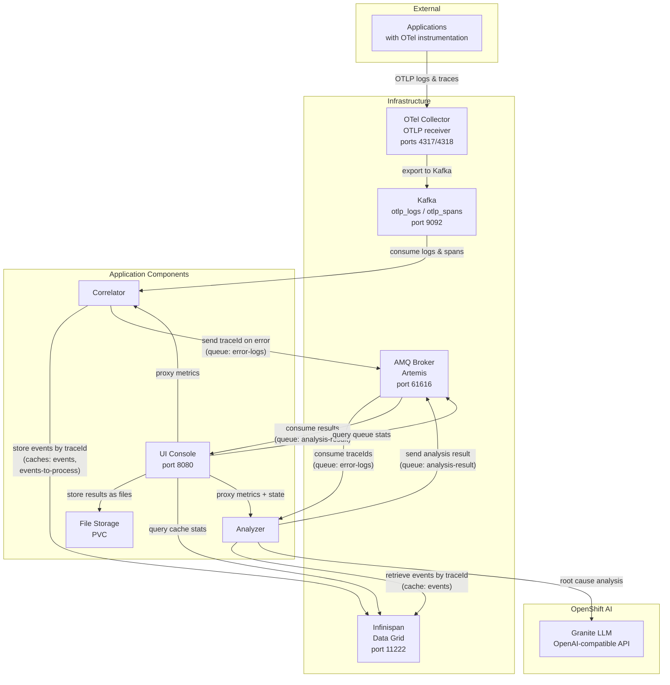
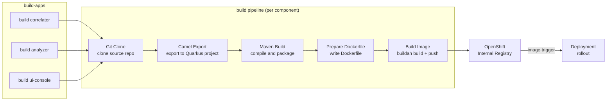

# Smart Log Analyzer OCP

Tekton pipelines and Helm chart for deploying Apache Camel JBang applications on the [Red Hat Developer Sandbox](https://developers.redhat.com/developer-sandbox). The `build` pipeline builds container images from Camel JBang source code. Application deployment is managed by a Helm chart. A CronJob polls the source repository for changes and automatically creates `build` PipelineRuns only for the components that changed.

## Table of Contents

1. [Application Architecture](#application-architecture)
2. [Build Pipeline](#build-pipeline)
3. [Project Structure](#project-structure)
4. [Prerequisites](#prerequisites)
5. [Get Access to the Developer Sandbox](#get-access-to-the-developer-sandbox)
6. [Install the CLI Tools](#install-the-cli-tools)
7. [Log In to the Cluster](#log-in-to-the-cluster)
8. [Clone This Repository](#clone-this-repository)
9. [Quick Start](#quick-start)
10. [Deploy the Infrastructure](#deploy-the-infrastructure)
11. [Configure OpenAI Credentials](#configure-openai-credentials)
12. [Deploy Applications with Helm](#deploy-applications-with-helm)
13. [Build Application Images](#build-application-images)
14. [Verify the Installation](#verify-the-installation)
15. [Configuration Reference](#configuration-reference)
16. [Troubleshooting](#troubleshooting)
17. [Cleanup](#cleanup)

---

## Application Architecture



The **correlator** consumes OpenTelemetry logs and spans from Kafka, correlates them by traceId in Infinispan, and sends error traceIds to the AMQ `error-logs` queue. When cached events expire (after 20s without new errors), the traceId is also forwarded to the queue.

The **analyzer** picks up traceIds from the `error-logs` queue, retrieves the correlated events from Infinispan, sends them to an LLM (OpenAI-compatible API) for root cause analysis, and publishes the result to the `analysis-result` queue.

The **ui-console** consumes analysis results from the `analysis-result` queue, stores them as files, and exposes a REST API (port 8080) for listing and viewing results. It also proxies Prometheus metrics from all components and queries Infinispan/AMQ for live infrastructure stats.

All components receive infrastructure credentials (AMQ, Data Grid) and component-specific secrets (e.g. OpenAI API key) via Kubernetes Secrets injected as environment variables.

## Build Pipeline

The `build` pipeline converts Camel JBang source code into container images deployed on OpenShift. The `build-apps` pipeline runs three `build` pipelines in parallel (one per component).



The **Camel Export** step runs `camel export --runtime=quarkus` to convert the Camel JBang application into a standard Quarkus Maven project. The **Maven Build** step compiles it into a Quarkus fast-jar. The **Build Image** step uses Buildah to create the container image and push it to the OpenShift internal registry. The `image.openshift.io/triggers` annotation on the Deployment automatically triggers a rollout when a new image is pushed.

## Project Structure

```
smart-log-analyzer-ocp/
├── create.sh                              # Automated install script (infrastructure + apps + build)
├── delete.sh                              # Automated cleanup script
├── tasks/
│   ├── 10-init-workspace.yaml         # Fixes PVC permissions for workspace
│   ├── 11-camel-export.yaml           # Runs camel export to Quarkus
│   └── 12-prepare-dockerfile.yaml     # Writes Dockerfile from base-image-config ConfigMap to workspace
│
├── pipeline/
│   ├── build.yaml                     # Build pipeline: exports, compiles, and pushes container images
│   └── build-apps.yaml                # Meta-pipeline: starts build for all 3 components in parallel
│
├── pipelinerun/
│   └── build-run.yaml                 # Example PipelineRun for the correlator component
│
├── helm/
│   └── smart-log-analyzer/
│       ├── Chart.yaml                      # Helm chart metadata
│       ├── values.yaml                     # Default values (all components enabled)
│       ├── templates/
│       │   ├── deployment.yaml             # Deployment for each enabled component
│       │   ├── configmap.yaml              # App-config ConfigMap with application properties
│       │   ├── service.yaml                # Service for all enabled components
│       │   ├── route.yaml                  # Edge TLS Route for exposed components
│       │   └── pvc.yaml                    # PVC for components with persistent storage
│       └── properties/                     # Application properties per component
│           ├── correlator/
│           ├── analyzer/
│           └── ui-console/
│
├── resources/
│   ├── amq-broker/
│   │   └── artemis-sandbox.yaml             # AMQ Broker deployment (Artemis)
│   ├── infinispan/
│   │   ├── infinispan-sandbox.yaml          # Infinispan deployment (Data Grid)
│   │   └── caches/
│   │       ├── events.json                  # Cache config for 'events' (600s lifespan)
│   │       └── events-to-process.json       # Cache config for 'events-to-process' (20s lifespan)
│   ├── configmaps/
│   │   ├── base-image-config-quarkus.yaml       # Dockerfile for Quarkus fast-jar image layout
│   │   └── otel-infra-endpoints.yaml            # Endpoints for the OpenTelemetry infrastructure
│   ├── otel-infra/
│   │   ├── kafka/
│   │   │   └── kafka-sandbox.yaml           # Kafka deployment (Confluent cp-kafka, KRaft mode)
│   │   └── otel-collector/
│   │       └── values-sandbox.yaml          # Helm values for OpenTelemetry Collector
│   └── secrets/
│       ├── infra-accounts.yaml              # Infrastructure credentials (AMQ Broker, Data Grid)
│       └── openai.yaml                      # OpenAI/LLM credentials for the analyzer component
│
└── log-generator/                           # Optional: deploys a Camel app that generates test logs
```

## Prerequisites

- A free [Red Hat account](https://sso.redhat.com)
- A terminal with internet access
- `git`

## Get Access to the Developer Sandbox

The Red Hat Developer Sandbox provides a free OpenShift cluster with a pre-provisioned namespace. Key characteristics:

- **No cluster-admin access** -- you cannot install cluster-wide operators or create ClusterRoles
- **Pre-installed operators** -- OpenShift Pipelines (Tekton) is available; other components are deployed as containers
- **Pre-provisioned namespace** -- you use your assigned `<username>-dev` namespace
- **Resource quotas** -- CPU and memory are limited; you may need to reduce replica counts or memory limits
- **Idle timeout** -- pods may be scaled down after inactivity
- **30-day access** -- the sandbox expires after 30 days (you can re-register)

1. Go to [https://developers.redhat.com/developer-sandbox](https://developers.redhat.com/developer-sandbox)
2. Click **Start your sandbox for free** and log in with your Red Hat account
3. Complete the registration (phone verification may be required)
4. Once provisioned, click **Start using your sandbox** to open the OpenShift web console
5. In the sandbox landing page, find the **OpenShift AI** card and click **Try it** to activate the shared LLM inference services (Granite models). This provisions the models in the `sandbox-shared-models` namespace, which the analyzer component uses for root cause analysis

## Install the CLI Tools

You need the `oc` and `helm` CLIs on your local machine. The `tkn` CLI is optional but useful for monitoring pipeline runs.

### oc (OpenShift CLI)

Download from the OpenShift web console:

1. In the web console, click the **?** icon in the top-right corner
2. Select **Command line tools**
3. Download the `oc` binary for your OS and add it to your `PATH`

Alternatively, download from [mirror.openshift.com](https://mirror.openshift.com/pub/openshift-v4/clients/ocp/latest/).

### helm

```bash
# Linux
curl -fsSL https://raw.githubusercontent.com/helm/helm/main/scripts/get-helm-3 | bash

# macOS
brew install helm

# Windows (with Chocolatey)
choco install kubernetes-helm
```

Or follow the [official install guide](https://helm.sh/docs/intro/install/).

### tkn (optional)

```bash
# Linux
curl -LO https://mirror.openshift.com/pub/openshift-v4/clients/pipelines/latest/tkn-linux-amd64.tar.gz
tar xvf tkn-linux-amd64.tar.gz -C /usr/local/bin/ tkn

# macOS
brew install tektoncd-cli
```

Or follow the [official install guide](https://tekton.dev/docs/cli/).

## Log In to the Cluster

1. In the OpenShift web console, click your username in the top-right corner
2. Select **Copy login command**
3. Click **Display Token**
4. Copy the `oc login` command and run it in your terminal:

   ```bash
   oc login --token=sha256~XXXX --server=https://api.sandbox-XXXX.openshiftapps.com:6443
   ```

5. Verify your namespace:

   ```bash
   oc project
   ```

   You should see something like `<username>-dev`. This is your working namespace for all subsequent commands.

6. Store your namespace name for later use:

   ```bash
   export NS=$(oc project -q)
   echo "Using namespace: ${NS}"
   ```

## Clone This Repository

```bash
git clone https://github.com/mcarlett/smart-log-analyzer-ocp.git
cd smart-log-analyzer-ocp
```

## Quick Start

Two scripts automate the full installation and cleanup. They follow the same steps described in the sections below.

```bash
# Install everything (infrastructure, applications, build images)
./create.sh

# Remove everything
./delete.sh
```

If you prefer to run each step manually, follow the sections below.

## Deploy the Infrastructure

Only OpenShift Pipelines (Tekton) is pre-installed in the Developer Sandbox. Other operators (Data Grid, AMQ Broker, AMQ Streams) cannot be installed due to sandbox restrictions on cluster-scoped resources, so all infrastructure components are deployed as plain containers.

### Apply secrets and ConfigMaps

```bash
oc apply -f resources/secrets/
oc apply -f resources/configmaps/
```

### Deploy the OpenTelemetry infrastructure (Kafka + OTel Collector)

Deploy Kafka and an OpenTelemetry Collector that receives OTLP logs and traces and exports them to Kafka.

**Deploy Kafka:**

```bash
oc apply -f resources/otel-infra/kafka/kafka-sandbox.yaml
```

**Deploy the OpenTelemetry Collector via Helm:**

```bash
helm repo add open-telemetry https://open-telemetry.github.io/opentelemetry-helm-charts
helm repo update

helm install camel-otel-collector open-telemetry/opentelemetry-collector \
  -f resources/otel-infra/otel-collector/values-sandbox.yaml \
  -n "${NS}" --wait --timeout 300s
```

Once done, Kafka will be available at `kafka.${NS}.svc:9092` and the OTel Collector will be ready to receive traces and logs via OTLP.

### Deploy Infinispan (Data Grid)

```bash
oc apply -f resources/infinispan/infinispan-sandbox.yaml

# Wait for it to be ready
oc wait deployment/infinispan --for=condition=Available --timeout=180s
```

Create the caches:

```bash
ISPN_POD=$(oc get pod -l app=infinispan -o jsonpath='{.items[0].metadata.name}')

for CACHE_FILE in resources/infinispan/caches/*.json; do
  CACHE_NAME=$(basename "${CACHE_FILE}" .json)
  echo "Creating cache '${CACHE_NAME}'..."
  oc exec "${ISPN_POD}" -- curl -s \
    -u admin:password --digest \
    -X POST "http://localhost:11222/rest/v2/caches/${CACHE_NAME}" \
    -H 'Content-Type: application/json' \
    -d "$(cat "${CACHE_FILE}")"
  echo ""
done
```

### Deploy AMQ Broker

```bash
oc apply -f resources/amq-broker/artemis-sandbox.yaml

# Wait for it to be ready
oc wait deployment/artemis --for=condition=Available --timeout=180s
```

### Create infra-endpoints ConfigMap

```bash
oc create configmap infra-endpoints \
  --from-literal=ARTEMIS_BROKER_URL="tcp://artemis.${NS}.svc:61616" \
  --from-literal=INFINISPAN_HOSTS="infinispan.${NS}.svc:11222" \
  --dry-run=client -o yaml | oc apply -f -
```

## Configure OpenAI Credentials

The analyzer component requires access to an OpenAI-compatible API for root cause analysis. The default credentials in `resources/secrets/openai.yaml` point to a local Ollama instance.

To use a different provider, update the secret:

```bash
oc create secret generic openai \
  --from-literal=OPENAI_API_KEY="<your-api-key>" \
  --from-literal=OPENAI_BASE_URL="https://your-endpoint/v1" \
  --from-literal=OPENAI_MODEL="<model-name>" \
  --dry-run=client -o yaml | oc apply -f -
```

### Using OpenShift AI models on Developer Sandbox

The Developer Sandbox provides shared LLM inference services (e.g. Granite) in the `sandbox-shared-models` namespace. These endpoints use the OpenShift service serving CA for TLS and require an OpenShift authentication token.

**1. Identify the model endpoint:**

List the available inference services:

```bash
oc get inferenceservice -n sandbox-shared-models
```

The endpoint URL follows the pattern:
`https://<service-name>-predictor.sandbox-shared-models.svc.cluster.local:8443/v1`

You can verify the endpoint responds:

```bash
SA_TOKEN=$(oc create token default)
oc exec deploy/infinispan -- curl -sk \
  -H "Authorization: Bearer ${SA_TOKEN}" \
  https://isvc-granite-31-8b-fp8-predictor.sandbox-shared-models.svc.cluster.local:8443/v1/models
```

**2. Create the secret with a ServiceAccount token:**

The model endpoint requires an OpenShift authentication token instead of a traditional API key. Generate a long-lived token from your namespace's `default` ServiceAccount:

```bash
SA_TOKEN=$(oc create token default --duration=120h)

oc create secret generic openai \
  --from-literal=OPENAI_API_KEY="${SA_TOKEN}" \
  --from-literal=OPENAI_BASE_URL="https://isvc-granite-31-8b-fp8-predictor.sandbox-shared-models.svc.cluster.local:8443/v1" \
  --from-literal=OPENAI_MODEL="isvc-granite-31-8b-fp8" \
  --dry-run=client -o yaml | oc apply -f -
```

> **Note:** The token expires after the specified duration (5 days in this example). Regenerate it and update the secret when it expires.

**3. Trust the OpenShift service CA:**

The model endpoint uses a TLS certificate signed by the OpenShift service serving CA, which is not in the default JVM truststore. Create a ConfigMap with the `inject-cabundle` annotation -- OpenShift automatically populates it with the service CA certificate. The Helm chart handles the rest (an init container builds a JVM truststore from the injected CA at pod startup).

```bash
oc create configmap service-ca-bundle
oc annotate configmap service-ca-bundle \
  service.beta.openshift.io/inject-cabundle=true
```

> **Note:** This ConfigMap must be created **before** installing the Helm chart. The analyzer deployment references it via the `serviceCa` configuration in `values.yaml`.

### Using an external OpenAI-compatible API

For external providers (OpenAI, Ollama, etc.) that use publicly trusted TLS certificates, only the secret is needed -- no truststore configuration:

```bash
oc create secret generic openai \
  --from-literal=OPENAI_API_KEY="<your-api-key>" \
  --from-literal=OPENAI_BASE_URL="https://api.openai.com/v1" \
  --from-literal=OPENAI_MODEL="gpt-4o-mini" \
  --dry-run=client -o yaml | oc apply -f -
```

## Deploy Applications with Helm

Deploy the Helm chart:

```bash
helm install smart-log-analyzer helm/smart-log-analyzer/ \
  --set namespace="${NS}" \
  -n "${NS}"
```

To upgrade after changes:

```bash
helm upgrade smart-log-analyzer helm/smart-log-analyzer/ \
  --set namespace="${NS}" \
  -n "${NS}"
```

## Build Application Images

Apply the Tekton tasks and pipeline:

```bash
oc apply -f tasks/
oc apply -f pipeline/
```

Build all three components (correlator, analyzer, ui-console) with a single pipeline:

```bash
tkn pipeline start build-apps \
  -p namespace="${NS}" \
  --use-param-defaults \
  --showlog
```

The `build-apps` pipeline starts three parallel `build` pipeline runs (one per component) and waits for all of them to complete. Use `--showlog` to follow the progress in real time.

> **Note:** The `namespace` parameter must match your sandbox namespace so that images are pushed to the correct ImageStream.

You can also monitor individual builds:

```bash
tkn pipelinerun list
tkn pipelinerun logs -f <pipelinerun-name>
```

Once the images are pushed to the internal registry, the `image.openshift.io/triggers` annotation on the Deployments will automatically trigger a rollout.

Optionally, clean up completed pipeline and task runs to free resources (the sandbox has a limit of 30 ReplicaSets):

```bash
oc delete pipelinerun --all
oc delete taskrun --all
oc get rs --no-headers | awk '$2==0 && $3==0 && $4==0 {print $1}' | xargs -r oc delete rs
```

## Verify the Installation

1. **Check that all pods are running:**

   ```bash
   oc get pods
   ```

   You should see pods for:
   - `kafka-*` (Kafka)
   - `infinispan-*` (Data Grid)
   - `artemis-*` (AMQ Broker)
   - `camel-otel-collector-*` (OTel Collector)
   - `correlator-*` (application)
   - `analyzer-*` (application)
   - `ui-console-*` (application)

2. **Check the UI Console route:**

   ```bash
   oc get route ui-console -o jsonpath='https://{.spec.host}{"\n"}'
   ```

   Open the URL in your browser to access the UI Console.

3. **Check pipeline runs:**

   ```bash
   tkn pipelinerun list
   ```

4. **Check secrets:**

   ```bash
   oc get secret infra-accounts openai
   ```

## Configuration Reference

### build pipeline parameters

| Parameter | Default | Description |
|---|---|---|
| `repo-url` | `https://github.com/loop9x/smart-log-analyzer.git` | Git repository URL |
| `repo-revision` | `main` | Git branch, tag, or commit SHA |
| `app-path` | `correlator` | Path within the repo to the Camel app |
| `app-name` | `correlator` | Application name (used for the container image) |
| `namespace` | `slog-analyzer` | Target namespace for the container image |
| `camel-image` | `quay.io/mcarlett/camel-launcher:4.18.0` | Image with the Camel CLI |
| `gav` | `com.example:correlator:1.0.0` | Maven groupId:artifactId:version |
| `runtime-version` | _(empty)_ | Quarkus version. If empty, uses the default from camel export |
| `deps` | `camel-observability-services,...` | Additional dependencies for `camel export` via `--dep` |

### Helm chart values

| Value | Default | Description |
|---|---|---|
| `namespace` | `slog-analyzer` | Target namespace |
| `imageRegistry` | `image-registry.openshift-image-registry.svc:5000` | Container image registry |
| `components.<name>.enabled` | `true` | Enable/disable a component |
| `components.<name>.replicas` | `1` | Number of replicas |
| `components.<name>.memoryLimit` | `512Mi` | Memory limit |
| `components.<name>.strategy` | `RollingUpdate` | Deployment strategy |
| `components.<name>.expose` | `false` | Create an edge TLS Route |
| `components.<name>.storage.mountPath` | _(empty)_ | PVC mount path |
| `components.<name>.storage.size` | `1Gi` | PVC size |
| `components.<name>.extraEnv` | `[]` | Additional environment variables |
| `components.<name>.secrets` | `[]` | Additional Kubernetes Secrets to inject as env vars |
| `components.<name>.serviceCa.enabled` | `false` | Mount OpenShift service CA and build a JVM truststore via init container |
| `components.<name>.serviceCa.configMap` | `service-ca-bundle` | ConfigMap containing the injected service CA certificate |
| `nettyWorkaround` | `true` | Set `-Dio.netty.transport.noNative=true` |

### Secrets

**Infrastructure credentials** (`infra-accounts`):

| Key | Default | Description |
|---|---|---|
| `AMQ_USERNAME` | `artemis` | AMQ Broker admin username |
| `AMQ_PASSWORD` | `artemis` | AMQ Broker admin password |
| `DATAGRID_USERNAME` | `admin` | Infinispan/Data Grid admin username |
| `DATAGRID_PASSWORD` | `password` | Infinispan/Data Grid admin password |

**OpenAI credentials** (`openai`, used by the analyzer component):

| Key | Default | Description |
|---|---|---|
| `OPENAI_API_KEY` | `dummy` | API key (or ServiceAccount token for OpenShift AI) |
| `OPENAI_BASE_URL` | `https://isvc-granite-31-8b-fp8-predictor.sandbox-shared-models.svc.cluster.local:8443/v1` | Base URL of the OpenAI-compatible API |
| `OPENAI_MODEL` | `isvc-granite-31-8b-fp8` | Model to use for chat completion |

Application properties files are stored in `helm/smart-log-analyzer/properties/<component>/application-prod-quarkus.properties`. All credentials are injected as environment variables from Kubernetes Secrets via `envFrom`.

## Troubleshooting

### Resource Quota Exceeded

The sandbox has CPU and memory quotas. If pods are stuck in `Pending`:

```bash
oc describe resourcequota
oc get pods -o custom-columns=NAME:.metadata.name,MEM:.spec.containers[0].resources.limits.memory
```

Reduce memory limits and re-deploy:

```bash
helm upgrade smart-log-analyzer helm/smart-log-analyzer/ \
  --set namespace="${NS}" \
  -n "${NS}"
```

### Pods Scaled Down After Inactivity

The sandbox may idle pods after a period of inactivity. Access the route or run `oc get pods` to wake them up. If pods don't restart:

```bash
oc rollout restart deployment correlator analyzer ui-console
```

### Pods CrashLooping with Missing Secrets

Ensure the required secrets exist:

```bash
oc get secret infra-accounts openai
```

If missing, re-apply them:

```bash
oc apply -f resources/secrets/
```

### Image Pull Errors

Make sure the build pipeline completed successfully and pushed the images:

```bash
oc get is
```

Each ImageStream (correlator, analyzer, ui-console) should have a `latest` tag.

### Internal Registry Image Not Available for CronJob

If the CronJob fails because the image `image-registry.openshift-image-registry.svc:5000/openshift/cli:latest` is not available, edit the CronJob to use a public image:

```bash
oc patch cronjob poll-source-repo --type json \
  -p '[{"op":"replace","path":"/spec/jobTemplate/spec/template/spec/containers/0/image","value":"quay.io/openshift/origin-cli:latest"}]'
```

## Cleanup

To remove everything:

```bash
# Uninstall the Helm release
helm uninstall smart-log-analyzer

# Delete infrastructure
helm uninstall camel-otel-collector --ignore-not-found
oc delete -f resources/otel-infra/kafka/kafka-sandbox.yaml --ignore-not-found
oc delete -f resources/infinispan/infinispan-sandbox.yaml --ignore-not-found
oc delete -f resources/amq-broker/artemis-sandbox.yaml --ignore-not-found

# Delete all pipeline resources
oc delete pipelinerun --all
oc delete taskrun --all
oc delete pipeline --all
oc delete task --all

# Delete built image streams
oc delete is correlator analyzer ui-console --ignore-not-found

# Delete remaining resources
oc delete configmap infra-endpoints otel-infra-endpoints base-image-config-quarkus service-ca-bundle --ignore-not-found
oc delete secret infra-accounts openai service-ca-truststore --ignore-not-found
```
